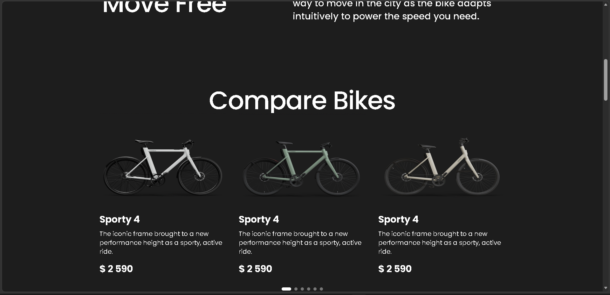
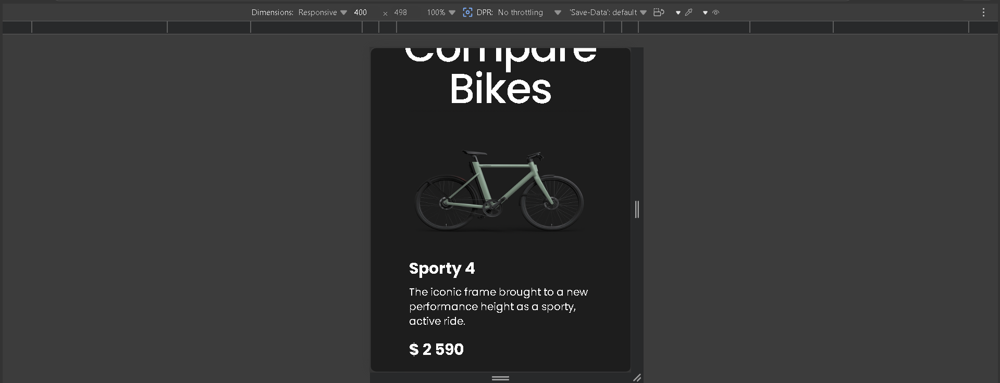

# 🚴 Bike Landing Page

Modern and responsive landing page for a bike-related product or service. Built with a focus on clean design, usability, and smooth user experience across all devices.

🔗 **Live Demo:** https://pavlolab.github.io/bike/

---

## 🖼️ Preview

---

## 🚀 Features

- Fully responsive design (mobile → desktop)
- Clean and modern UI
- Well-structured layout with clear sections
- Smooth hover effects and transitions
- Basic interactivity with JavaScript
- Reusable and organized components

---

## 💼 What I Can Do For You

- Build responsive landing pages from Figma or design files  
- Create clean and modern website layouts  
- Improve UI/UX and responsiveness  
- Fix HTML, CSS, and layout issues  

---

## 🛠️ Tech Stack

- HTML5  
- SCSS / CSS3  
- Flexbox & CSS Grid  
- JavaScript  

---

## 📌 About This Project

This project demonstrates my ability to create responsive and visually appealing landing pages with clean structure and attention to user experience.

---

## 📩 Contact

- GitHub: https://github.com/pavlolab  
- Email: pavlolab.studio@gmail.com